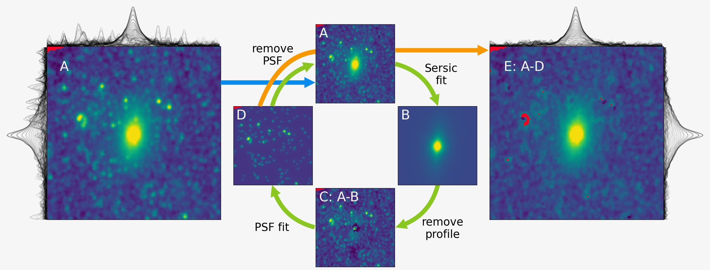

# sphot

Sphot (Sersic phtometry) is a package designed for performing an accurate color measurement of galaxies in a crowded field.
This package is under development.

For usage and tutorials, please see [the documentation page](https://sphot.readthedocs.io/en/latest/).
